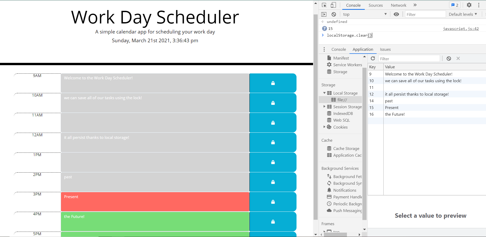

# Daily Scheduler
**Challenge #5**

Welcome to my daily scheduler, this is a simple application that enables users to simple add a task or appointment in the most appropiate timeslot for them. 

Users are able to edit such text fields and save them by clicking on the lock item so items remain after reloading/closing the site.

###The Tech

**Bootstrap**
Bootstrap allows us to quickly create text fields and perfectly aligned sections and tables. We are going to be using the *textarea* element to quickly create and gather the user input.

**MomentJS**
Moment JS allows us to easily insert the current time into our project. We are able to change the color of our textarea fields according to whether they are in the past - present -future using javascript + JQuery

**JQuery**
JQuery saves us lots of time and code by simplyfying lots of the syntax around our project. Below are the most handy methods we encountered during this project:

*siblings() and Tree Traversal methods* 
- This method allowed us to quickly select elements and relate them to neighboring ones by following a logical path of inheritance. See code lines 17-36 in JS file to see it in action.

*abreviations*
-"$", "attr", "text","on", and "val", are all widely used in our code and considerable cut down in the number of lines we wrote.

###Bonus
feel free to read through the JS and HTML files as they have handy and useful comments left for you to grab a good understanding of the logic used when making this project.

Thank you, and happy coding!
___________________________

